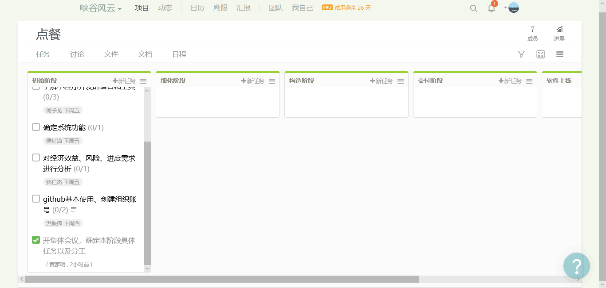
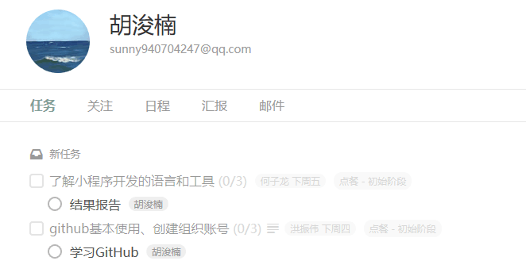

### 一、简答题

#### 1.简述瀑布模型、增量模型、螺旋模型（含原型方法）的优缺点

> 瀑布模型的优点：
> 
>    * 保证整个软件产品较高的质量，保证缺陷能够提前地被发现和解决
>    * 保证系统在整体上的充分把握，使系统具备良好的扩展性和可维护性
> 
>    缺点：
>    * 对于前期需求不明确，而又很难短时间明确清楚的项目很难很好利用该模型
>    * 对于中小型项目，需求设计和开发人员往往在项目开始后就会全部投入到项目中，而不是分阶段投入，因此会导致项目人力资源过多的闲置问题
>           
> 增量模型的优点：
> 
>    * 能够很好的控制前期的风险并解决
>    * 从总体的方面系统地思考问题，从最早就可以给出相对完善的框架或原型，后期的每次迭代都是针对上次迭代的逐步精
> 
>    缺点：
>    * 并行开发构件有可能遇到不能集成的风险，软件必须具备开放式的体系结构
>    * 其灵活性可以使其适应变化的能力大大优于瀑布模型，但也容易退化为边做边改模型，从而使软件过程的控制失去整体性
> 
> 螺旋模型的优点：
> 
>    * 设计的灵活性，可以在项目的各个阶段进行变更
>    * 以小的分段来构建大型系统，使成本计算变得简单容易
>    * 客户始终参与每个阶段的开发，保证了项目不偏离正确方向以及项目可控性
>           
>    缺点：
>    * 过多的迭代次数会增加开发成本，延迟提交时间
>    * 需要相当丰富的风险评估经验和专业知识，如若未能及时标识风险，会造成重大损失

#### 2.简述UP的三大特点，其中哪些内容体现了用户驱动的开发，哪些内容体现风险驱动的开发？
> * Architecture Centric（以架构为中心的）:software architecture provides the central point around which all other development evolves
 Use Case Driven（用例驱动）:Use cases are expressed from the perspective of the users, in natural language, and should be understandable by all stakeholders. Use-case-driven means the development team employs the use cases from requirements gathering through code and test
 Iterative and Evolutionary（受控的迭代式增量开发）:An iterative and evolutionary approach allows start of development with incomplete, imperfect knowledge
> *  用例驱动以及受控的迭代式增量开发体现了用户驱动的开发，以架构为中心体现了风险驱动的开发

#### 3.UP四个阶段的划分准则是什么？关键的里程碑是什么？
> * Inception（初始）：大体的构造、范围和评估。里程碑：生命周期目标里程碑（评价项目基本的生存能力）
> * Elaboration（细化）：迭代核心架构。里程碑：生命周期结构里程碑（检验详细的系统目标和范围、系统的选择以及主要风险的解决方案）
> * Construction（构造）：所有剩余的构件和应用程序功能并集成产品，所有的功能被详细测试。里程碑：初始功能里程碑（确定了产品是否可以在测试环境中进行部署；要确定软件、环境、用户是否可以开始系统的运作）
> * Transition（移交）：为发布做准备的产品测试，基于用户反馈做少量调整。里程碑：产品发布里程碑（确定目标是否实现，是否开始另一个开发周期）

#### 4.IT 项目管理中，“工期、质量、范围/内容” 三个元素中，在合同固定条件下，为什么说“范围/内容”是项目团队是易于控制的
> * 在合同固定的条件下，工期和质量都在合同上规定好的，不能随意变动。只有范围/内容才是能项目团队所掌握。

#### 5.为什么说，UP 为企业按固定节奏生产、固定周期发布软件产品提供了依据？
> * UP是用户驱动的、基于架构的、迭代增量开发的过程。UP的每个阶段都可以分解为迭代。每一次迭代，都有一个新产品的产生，并且每一次迭代时间都是限制的，时间定量是迭代开发的关键思想。因此，UP为企业按固定节奏生产，固定周期发布软件产品提供了依据。

------

### 二、项目管理使用

#### 使用截图工具（png格式输出），展现你团队的任务 Kanban

