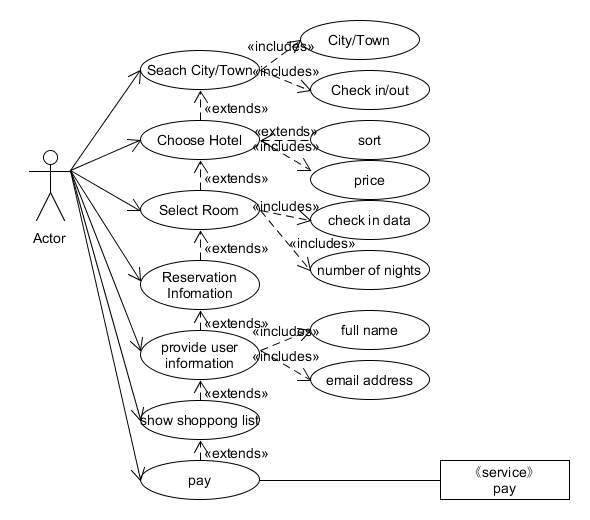
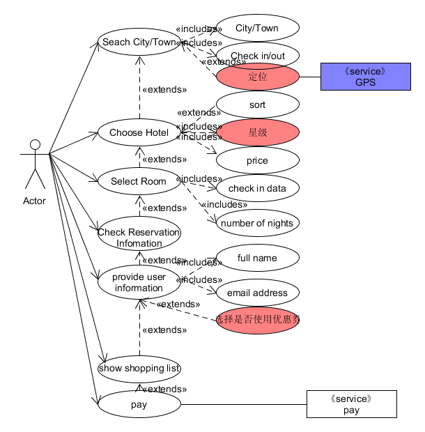
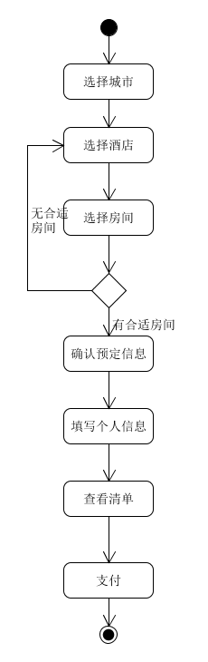
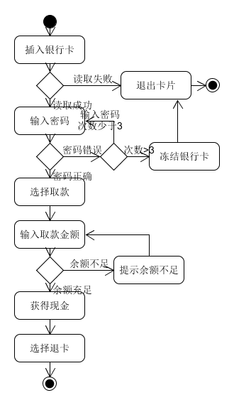
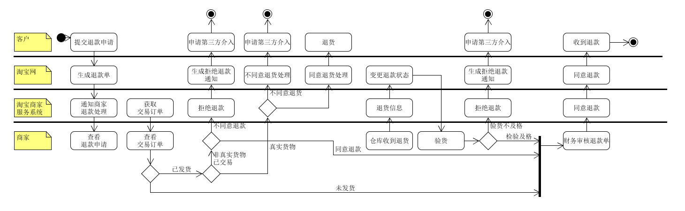

### 1、 用例建模

#### •a. 阅读 Asg_RH 文档，绘制用例图。 按 Task1 要求，请使用工具 UMLet，截图格式务必是 png 并控制尺寸

#### •b. 选择你熟悉的定旅馆在线服务系统（或移动 APP），如绘制用例图。并满足以下要求：

对比 Asg_RH 用例图，请用色彩标注出创新用例或子用例

尽可能识别外部系统，并用色彩标注新的外部系统和服务

#### •c. 对比两个时代、不同地区产品的用例图，总结在项目早期，发现创新的思路与方法

> 从两个时代的用例图，可以发现现在比过去在客户选择旅店的时候会考虑更多的服务，提供更人性化的服务。在不同的地区，付款方式可能不同，或者有些只支持支付宝，或者有些支持微信支付，因此要提供不同支付方式的支持。所以，在项目早期，可以通过目前的需求画用例图，然后通过与其它软件的用例图做比较，观察可以改进或者冗余的用例。

#### •d. 请使用 SCRUM 方法，在（任务b）用例图基础上，编制某定旅馆开发的需求 （backlog）

| ID| 需求名称 | 重要性 | 工作量 | 需求目标 | 注意事项 |
| :--: | :--: | :--: | :--: | :--: | :--: |
| 1 | 选择城市 | 80 | 10 | 填写城市、入住及退房日期 | 可用GPS自动获取当前位置 |
| 2 | 选择酒店 | 90 | 20 | 选择旅店 | 旅店可按照星级、价格、好评等排序 |
| 3 | 选择房间 |  100 | 30 | 选择房间类型及数量 | 房间显示选择时间内的冗余数量 |
| 4 | 确认预定信息 | 80 | 15 | 确认及提交订单 | 自动补全入住和退房时间 |
| 5 | 填写个人信息 | 70 | 15 | 填写个人资料及联系方式 | 必须使用有效的证件号码与联系方式且注意对用户信息的保护 |
| 6 | 查看清单 | 60 | 15 | 确认详细清单，包括旅店房间信息及个人信息 | |
| 7 | 支付 | 50  | 10 | 选择付款方式，进行付款 | 提供多种第三方支付系统，支付失败及时给予反馈信息 |

### 2、业务建模

#### •a. 在（任务b）基础上，用活动图建模找酒店用例。简述利用流程图发现子用例的方法。

> 总结：
> 流程图的一些步骤本身就可以作为一个单独的子用例。
> 流程图的分叉节点和合并节点之间能抽象汇总为一个子用例。

#### •b. 选择你身边的银行 ATM，用活动图描绘取款业务流程

#### •c. 查找淘宝退货业务官方文档，使用多泳道图，表达客户、淘宝网、淘宝商家服务系统、商家等用户和系统协同完成退货业务的过程。分析客户要完成退货业务，在淘宝网上需要实现哪些系统用例

### 3、用例文本编写

#### •在大作业基础上，分析三种用例文本的优点和缺点

•摘要式用例文本
>  优点：简洁，能让团队成员快速了解主题和范围，编写时间短。
>  
>  缺点：不够细节，在项目中后期造成理解上的困难，需求不够清晰。

•非正式用例文本
>  优点：较简洁，仍不会涉及太多的细节和复杂分析，但比摘要用例详细。
>  
>  缺点：在项目后期进行开发时会显得要求不清晰，不利于深入分析需求。

•详述用例文本
>  优点：对于每个用例有具体的业务流程说明。
>  
>  缺点：编写复杂，耗时长，且需要考虑各种繁琐的细节。