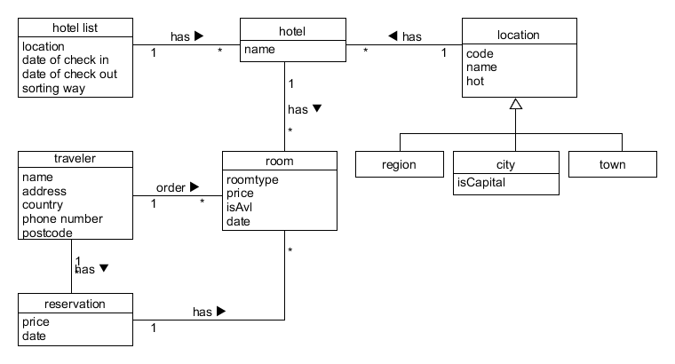
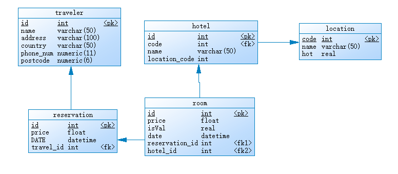

### 1、 领域建模

#### a. 阅读 Asg_RH 文档，按用例构建领域模型。 

按 Task2 要求，请使用工具 UMLet，截图格式务必是 png 并控制尺寸

说明：请不要受 PCMEF 层次结构影响。你需要识别实体（E）和中介实体（M，也称状态实体） 

在单页面应用（如 vue）中，E一般与数据库构建有关，M一般与store模式有关

在 java web 应用中，E一般与数据库构建有关，M一般与 session 有关

#### b. 数据库建模(E-R 模型)

按 Task 3 要求，给出系统的 E-R 模型（数据逻辑模型）

建模工具 PowerDesigner（简称PD） 或开源工具 OpenSystemArchitect

不负责的链接 http://www.cnblogs.com/mcgrady/archive/2013/05/25/3098588.html

导出 Mysql 物理数据库的脚本

简单叙说 数据库逻辑模型 与 领域模型 的异同

>>/*==============================================================*/
>>/* DBMS name:      MySQL 5.0                                    */
>>/* Created on:     2018/4/29 22:53:48                           */
>>/*==============================================================*/
>>
>>
>>drop table if exists hotel;
>>
>>drop table if exists location;
>>
>>drop table if exists reservation;
>>
>>drop table if exists room;
>>
>>drop table if exists traveler;
>>
>>/*==============================================================*/
>>/* Table: hotel                                                 */
>>/*==============================================================*/
>>create table hotel
>>
>>(
>>
>>   id                   int not null,
>>
>>   code                 int,
>>
>>   name                 varchar(50) not null,
>>
>>   location_code        int not null,
>>
>>   primary key (id)
>>
>>);
>>
>>/*==============================================================*/
>>/* Table: location                                              */
>>/*==============================================================*/
>>create table location
>>
>>(
>>
>>   code                 int not null,
>>
>>   name                 varchar(50) not null,
>>
>>   hot                  real not null,
>>
>>   primary key (code)
>>
>>);
>>
>>/*==============================================================*/
>>/* Table: reservation                                           */
>>/*==============================================================*/
>>create table reservation
>>
>>(
>>
>>   id                   int not null,
>>
>>   price                float not null,
>>
>>   DATE                 datetime not null,
>>
>>   travel_id            int not null,
>>
>>   key AK_Key_1 (id)
>>
>>);
>>
>>/*==============================================================*/
>>/* Table: room                                                  */
>>/*==============================================================*/
>>create table room
>>
>>(
>>
>>   id                   int not null,
>>
>>   price                float not null,
>>
>>   isVal                real not null,
>>
>>   date                 datetime not null,
>>
>>   reservation_id       int not null,
>>
>>   hotel_id             int not null,
>>
>>   primary key (id)
>>
>>);
>>
>>/*==============================================================*/
>>/* Table: traveler                                              */
>>/*==============================================================*/
>>create table traveler
>>
>>(
>>
>>   id                   int not null,
>>
>>   name                 varchar(50) not null,
>>
>>   address              varchar(100) not null,
>>
>>   country              varchar(50) not null,
>>
>>   phone_num            numeric(11,0) not null,
>>
>>   postcode             numeric(6,0) not null,
>>
>>   primary key (id)
>>
>>);
>>
>>alter table hotel add constraint FK_Reference_4 foreign key (code) references location (code) on delete restrict on update restrict;
>>
>>
>>alter table reservation add constraint FK_Reference_1 foreign key (travel_id) references traveler (id) on delete restrict on update restrict;
>>
>>
>>alter table room add constraint FK_Reference_2 foreign key (reservation_id) references reservation (id) on delete restrict on update restrict;
>>
>>
>>alter table room add constraint FK_Reference_3 foreign key (hotel_id) references hotel (id) on delete restrict on update restrict;
>>

数据库逻辑模型与领域模型 的异同:

>> * 异：数据库模型面向实际代码开发而领域模型面向需求。数据库逻辑模型明确给出各字段的具体设计，更便于程序设计
>> * 同：都是将数据库的类给图像化，具体化。
