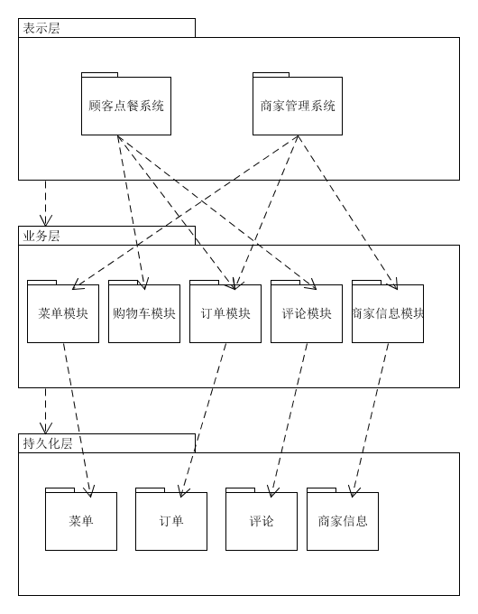

## 描述软件架构与框架之间的区别与联系

> *架构就是把系统分解为一些部件，描述这些部件的职责及其协同作用。软件架构是指在一定的设计原则基础上，从不同角度对组成系统的各部分进行搭配和安排，形成系统的多个结构而组成架构，它包括该系统的各个组件，组件的外部可见属性及组件之间的相互关系。组件的外部可见属性是指其他组件对该组件所做的假设。
> 
> *框架是特定语言和技术的架构应用解决方案，是具体语言和技术相关的，是一种或多种架构的组合的实现。框架是集成了你的代码和多种第三方解决方案的工具，让你聚焦业务逻辑代码而不是技术实现。
> 
> *区别：框架是软件，架构不是软件。框架落脚在“架”字上，可以理解成名词性的，是一个客观性的名词存在，如.Net Framework；而架构体现在“构”字上，理解成构造，是一个动词性的，是一系列动作发生的策略性体现。框架是一种特殊的软件，它并不能提供完整无缺的解决方案，而是为你构建解决方案提供良好的基础。框架是半成品。典型地，框架是系统或子系统的半成品；框架中的服务尅被最终应用系统直接调用，而框架中的扩展点是供应用开发人员定制的“可变化点”。架构不是软件，而是关于软件如何设计的重要策略。软件架构决策设计到如何将软件系统分解成不同的部分、各部分之间的静态结构关系和动态交互关系等。
> 
> *联系：经过完整的开发过程之后，架构决策将体现在最终开发出的软件系统中；当然，引入软件架构之后，整个开发过程变成了“分两步走”，而架构决策往往会体现在框架之中。

## 以你的项目为案例 

### 绘制三层架构模型图，细致到分区

### 结合你程序的结构，从程序员角度说明三层架构给开发者带来的便利

> *开发人员可以只关注某一层
> 
> *前后端分离，不同层负责不同层面。并行开发支持。利用前后端分离，实现并行开发。
> 
> *项目结构更清晰，分工更明确
> 
> *利于各层逻辑的复用
> 
> *开发次序和重要性是明确的。领域模型、基础模块（用户和基础数据的DTO和Service必须优先开发与测试），能减少这些模块的错误，特别是领域模型设计失误。

## 研究 VUE 与 Flux 状态管理的异同

> 异：Flux状态管理分为四层：view视图层、action层、dispatcher派发层、store仓库层。Flux使view查询store，用户交互触发的action被提交到dispatcher中。当action被派发后，store会随之更新自己并且通知view进行修改。而Vue区分同步更新和异步更新。Vue的更新直接通过state实例，作为state方法来调用。
> 
> 同：vue和flux都是基于CQRS思想，更新和引用的数据流动时单向的，避免当一个Model被多个View引用时，一个Model被View改变时导致的混乱的波纹扩散式更新。而且都用store来存储状态，都提供数据驱动的、可组合搭建的视图组件。