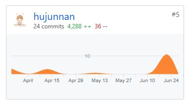
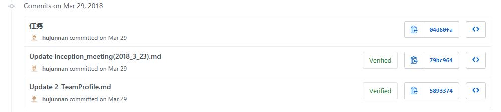
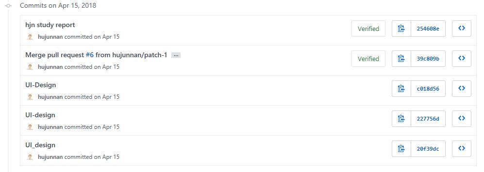
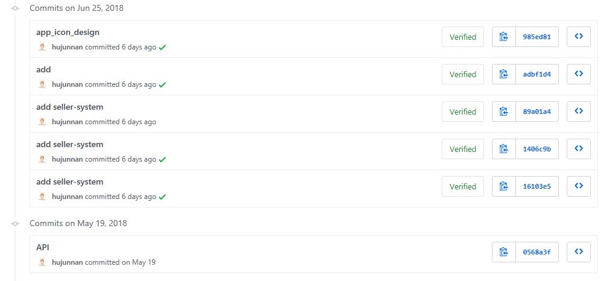
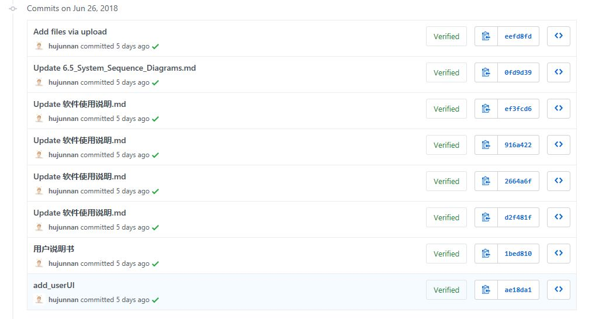
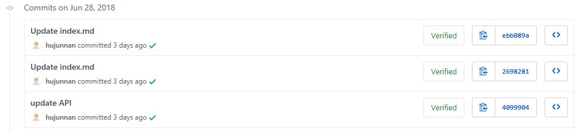
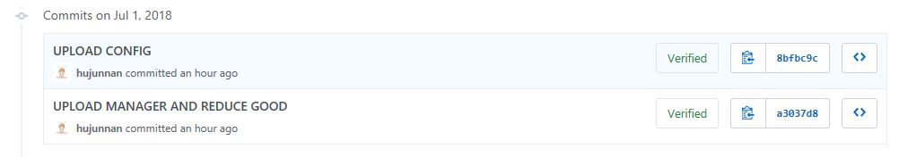

# final report

## author: hjn 15331107

### PSP 2.1 统计表

| PSP 2.1 | Personal Software Process Stages | Time/h |
| - | - | - |
| **Planning** | **计划** | **8** |
| -　Estimate | -估计这个任务需要多少时间  | 8 |
| **Development** | **开发** | **68** |
| -　Analysis | -需求分析（包括学习新技术） | 20 |
| -　Design Spec | -生成设计文档 | 20 |
| -　Design Review | -设计复审（和同事审核设计文档） | 6 |
| -　Coding Standard | -代码规范（为目前的开发制定合适的规范） | 3 |
| -　Design | -具体设计 | 8 |
| -　Coding| -具体编码 | 10 |
| -　Code Review | -代码复审 | 0 |
| -　Test | 测试（自我测试，修改代码，提交修改） | 1 |
| **Report** | **报告** | **6** |
| -　Test Report | 测试报告 | 3 |
| -　Size Measurement| 计算工作量 | 1 |
| -　Postmortem & Process Improvement Plan| -事后总结，并提出过程改进计划| 2 |

### 个人GITt统计报告

### 最得意/或有价值/或有苦劳的工作清单

| 工作 | 说明 |
| :--: | :--: |
| 商家端文档撰写 | 负责了商家端的ui设计、用例、活动图、顺序图、类图文档编写 |
| API设计 | 设计好API为前后端的工作提供了支持 |

### 个人的技术类、项目管理类博客清单

| 博客 |
| :--: |
|[微信小程序开发学习报告](https://github.com/CanyonSYSU/Dashboard/blob/master/documents/X2_TechWork_Report/15331107-微信小程序开发学习报告.md) |